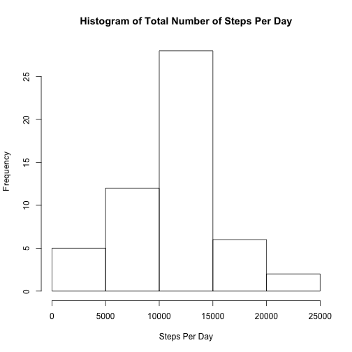
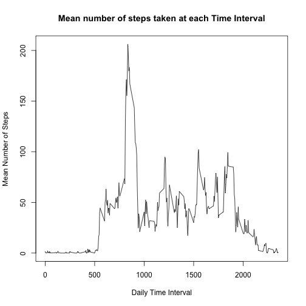
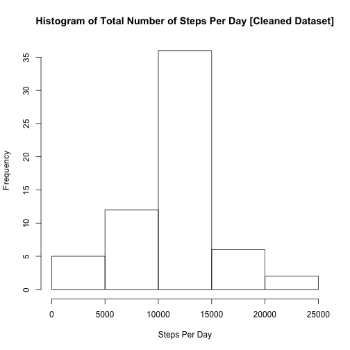
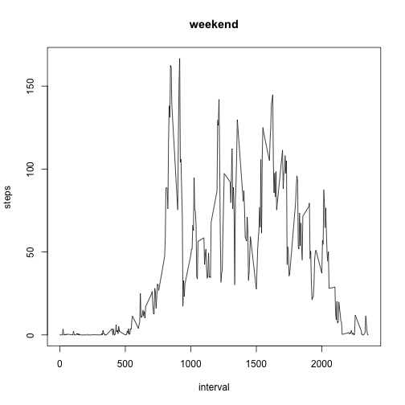
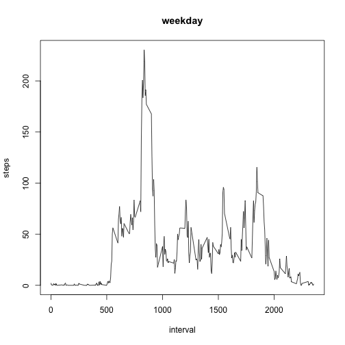

**This is the Peer Assessment 1 assignment for the "Reproducible Research" Course for Guy Hagen.**
  
This assignment makes use of data from a personal activity monitoring device. This device collects data at 5 minute intervals through out the day. The data consists of two months of data from an anonymous individual collected during the months of October and November, 2012 and include the number of steps taken in 5 minute intervals each day.


<div style="height:96px; border-bottom:8px solid #2e3192;"></div>
##Step 1: Loading and preprocessing the data

>**Assignment**: *Show any code that is needed to load the data (i.e. read.csv()).  Process/transform the data (if necessary) into a format suitable for your analysis*

The following code block loads the raw activity data, and prepares a data table containing only complete results which will be required for some mathematical functions which do not tolerate NA values.


```r
#Import that data file
activity.raw <- read.csv(fname,  header = T )

#Reformat the date factor for use as date format.
activity.raw$date <-as.Date(activity.raw$date, format="%Y-%m-%d")

#Omit the incomplete cases
activity.complete <-na.omit(activity.raw)

#Calculate the number of cases removed for a quick error check
omitted.cases <- format((nrow(activity.raw) - nrow(activity.complete)), digits=2, big.mark=',', nsmall=2)
```

The preprocessing step removed  2,304 incomplete cases; the data frame containing only complete cases will be used for assignment Step 2 and Step 3.

<div style="height:96px; border-bottom:8px solid #2e3192;"></div>

##Step 2: What is mean total number of steps taken per day?

>**Assignment**: *For this part of the assignment, you can ignore the missing values in the dataset. Make a histogram of the total number of steps taken each day. Calculate and report the mean and median total number of steps taken per day.*


```r
#Group the activity table cases by day, as an intermediary processing step
stepsperday <- aggregate(activity.complete$steps, by=list(activity.complete$date), FUN=sum)[2]

#Perform the descriptive statistics on the daily total number of steps
stepsperday.mean<-mean(stepsperday$x)
stepsperday.median<-median(stepsperday$x)
stepsperday.mean.formatted <-format(stepsperday.mean, digits=2, big.mark=',', nsmall=2)
stepsperday.median.formatted <-format(stepsperday.median, digits=2, big.mark=',', nsmall=2)


#Generate a simple histogram to show the frequency spread of total steps per day
hist(stepsperday$x, main="Histogram of Total Number of Steps Per Day", xlab="Steps Per Day")
```

 

**Results**: The mean number of steps taken per day was **10,766.19** and the median number of steps taken per day was **10,765**.


 Results| Mean | Median
 --------------|---------|--------
 Steps Per Day |**10,766.19**|**10,765**
<div style="height:96px; border-bottom:8px solid #2e3192;"></div>

##Step 3: What is the average daily activity pattern?

>**Assignment**: *Make a time series plot (i.e. type = "l") of the 5-minute interval (x-axis) and the average number of steps taken, averaged across all days (y-axis). Which 5-minute interval, on average across all the days in the dataset, contains the maximum number of steps?*


```r
#As a quick error / exploratory step, let's see how many intervals there are in the table:
interval.count<-length(unique(activity.complete$interval))

#Also, the largest interval value:
interval.largestinterval<-format(max(unique(activity.complete$interval)), digits=2, big.mark=',', nsmall=2)

#Group the activity table cases by day, as an intermediary processing step
stepsperinterval <- aggregate(activity.complete$steps, by=list(activity.complete$interval), FUN=mean)
names(stepsperinterval)<-c("interval", "mean.steps")

#Generate a linear plot of mean steps across the daily intervals.
plot(stepsperinterval$interval, stepsperinterval$mean.steps, type="l", xlab="Daily Time Interval", main="Mean number of steps taken at each Time Interval", ylab="Mean Number of Steps")
```

 

```r
#Exploratory - what is the largest mean value we see in the data?  test this against final findings.
interval.largestvalue<-max(stepsperinterval$mean.steps)

#Identify the case (row) number that contains the largest "mean steps" value.
interval.largestcase<-which.max(stepsperinterval$mean.steps)

#Extract the entire case row from the table that contains the largest "mean steps" value
interval.target<-stepsperinterval[interval.largestcase,]
```
  
**Results**: There are **288** intervals in the table, with the largest being **2,355**.  The maximum number of mean steps recorded for any interval was **206.17**.  This peak activity occurred at **Interval 835**.

<div style="height:96px; border-bottom:8px solid #2e3192;"></div>
##Step 4: Imputing missing values
>**Assignment**: *Note that there are a number of days/intervals where there are missing values (coded as NA). The presence of missing days may introduce bias into some calculations or summaries of the data.*

>*Calculate and report the total number of missing values in the dataset (i.e. the total number of rows with NAs).*

>*Devise a strategy for filling in all of the missing values in the dataset. The strategy does not need to be sophisticated. For example, you could use the mean/median for that day, or the mean for that 5-minute interval, etc.*

>*Create a new dataset that is equal to the original dataset but with the missing data filled in.*

>*Make a histogram of the total number of steps taken each day and Calculate and report the mean and median total number of steps taken per day. Do these values differ from the estimates from the first part of the assignment? What is the impact of imputing missing data on the estimates of the total daily number of steps?*


```r
#First, we have to report the total number of missing values in the dataset.  Remember, we
#calculated that back in Step 1 just to make sure our data looked right.
# omitted.cases <- format((nrow(activity.raw) - nrow(activity.complete)), digits=2, big.mark=',', nsmall=2)

#Objective: Devise a strategy for filling in all of the missing values in the dataset. 
#The interval frequencies we calculated at the last Step show a lot of variability, so our strategy will be to fill in the missing values with the mean scores at each interval.  Let's start by preparing a new table/dataset based on the original dataset with missing values:
activity.cleaned <- activity.raw
activity.cleaned$raw <-activity.cleaned$steps
#head(activity.cleaned,100)

#Now let's loop through our new table.  For each case with missing values, let's refer to the table (step) that we created containing mean steps per interval, and replace the missing step value with the mean value for that same interval.


#Objective: Create a new dataset that is equal to the original dataset but with the missing data filled in.
#there are far fewer intervals than number of cases, so let's loop through them instead of the actual data, and let R do the heavy lifting
for (i in 1:nrow(stepsperinterval)) {
      #find the interval indentifier, and mean number of steps for this interval from complete cases
      this.interval<-stepsperinterval$interval[i]
      this.meansteps<-stepsperinterval$mean.steps[i]
     
      #now assign that mean value to all cases in the new dataset with NA values at this interval.
   activity.cleaned$steps[( (activity.cleaned$interval==this.interval)&is.na(activity.cleaned$steps))] <- this.meansteps
  
}

#Group the activity table cases by day, as an intermediary processing step
stepsperday <- aggregate(activity.cleaned$steps, by=list(activity.cleaned$date), FUN=sum)[2]


#For comparison purposes, let's remember the previous mean and median values for the complete set.
stepsperday.oldmean <- stepsperday.mean
stepsperday.oldmedian <- stepsperday.median
stepsperday.oldmean.formatted <- stepsperday.mean.formatted
stepsperday.oldmedian.formatted <- stepsperday.median.formatted

#Perform the descriptive statistics on the daily total number of steps
stepsperday.mean<-mean(stepsperday$x)
stepsperday.median<-median(stepsperday$x)
stepsperday.mean.formatted <-format(stepsperday.mean, digits=2, big.mark=',', nsmall=2)
stepsperday.median.formatted <-format(stepsperday.median, digits=2, big.mark=',', nsmall=2)

#Let's compare the difference between the new dataset and the original complete dataset.
diff.mean <- (stepsperday.mean-stepsperday.oldmean)
diff.median <- (stepsperday.median-stepsperday.oldmedian)
diff.mean.formatted <-format(diff.mean, digits=2, big.mark=',', nsmall=2)
diff.median.formatted <-format(diff.median, digits=2, big.mark=',', nsmall=2)

#Output: create a histogram of the steps taken each day on the new dataset.
hist(stepsperday$x, main="Histogram of Total Number of Steps Per Day [Cleaned Dataset]", xlab="Steps Per Day")
```

 
  
**Results**: The mean number of steps taken per day was **10,766.19** and the median number of steps taken per day was **10,766.19**.


```r
#Let's format and output the statistics for comparison between tables.
means=c(stepsperday.oldmean.formatted, stepsperday.mean.formatted, diff.mean.formatted)
medians=c(stepsperday.oldmedian.formatted, stepsperday.median.formatted, diff.median.formatted)
rlabels=c("Steps Per Day [complete dataset]", "Steps Per Day [cleaned dataset]", "Difference")
output <-data.frame(rlabels, means,medians)
names(output)<-c("", "Mean", "Median")
kable(output)
```


|                                 |Mean      |Median    |
|:--------------------------------|:---------|:---------|
|Steps Per Day [complete dataset] |10,766.19 |10,765    |
|Steps Per Day [cleaned dataset]  |10,766.19 |10,766.19 |
|Difference                       |0.00      |1.19      |


 
**Assignment Question: Calculate and report the mean and median total number of steps taken per day. Do these values differ from the estimates from the first part of the assignment? **
**Answer**: Yes, there is a slight difference between the dataset of complete cases and the "cleaned" dataset.

**Assignment Question: What is the impact of imputing missing data on the estimates of the total daily number of steps?**
**Answer**: Since we are infilling missing values with "mean" values, there obviously is no impact on the mean daily steps statistics.  However, there is a small impact as the median number of daily steps increased 1.19 steps from the complete values dataset.


<div style="height:96px; border-bottom:8px solid #2e3192;"></div>
##Step 5: Are there differences in activity patterns between weekdays and weekends?

>**Assignment**: *For this part the weekdays() function may be of some help here. Use the dataset with the filled-in missing values for this part.*

>*Create a new factor variable in the dataset with two levels -- "weekday" and "weekend" indicating whether a given date is a weekday or weekend day.*

>*Make a panel plot containing a time series plot (i.e. type = "l") of the 5-minute interval (x-axis) and the average number of steps taken, averaged across all weekday days or weekend days (y-axis). The plot should look something like the following, which was created using simulated data.*


```r
#Let's set up a vector that contains the actual day of the week.
activity.cleaned$dayofweek<-weekdays(activity.cleaned$date)

#Now let's start categorizing those days by weekday or weekend
#First, prefill with default value
activity.cleaned$daytype <- "weekday"
#Next, let's correct just those cases which fall on a weekend
activity.cleaned$daytype[activity.cleaned$dayofweek=="Saturday" | activity.cleaned$dayofweek=="Sunday"] <- "weekend"

#Make sure it's converted to a factor.
activity.cleaned$daytype <-factor(activity.cleaned$daytype)
```

**Results**: Generate line charts for weekday days and weekend dates.
  

```r
#Now, let's plot out the line charts by weekday and weekend.  we'll use the same general method we used for Step 3, except that we'll iterate (and aggregate) separately for weekdays and weekends.
par(mfrow = c(2, 1))
layout(matrix(c(1,1)), heights=c(2,2))
for (chart.daytype in c("weekend", "weekday")) {
    stepsperinterval <- aggregate(steps ~ interval, data = activity.cleaned, subset=daytype == 
        chart.daytype, FUN=mean)
    plot(stepsperinterval, type = "l", main = chart.daytype )
}
```

  


